# 环境 {#env}

环境就是作用域发挥作用的数据结构，本章将深入学习环境的概念，由于环境具有引用语义，所以本身他们也是一种很有用的数据结构，当在一个环境中对其绑定的元素进行修改时，环境不会被复制，修改会在原地进行。虽然不会经常使用引用语义，但他还是非常有用的。

## 环境基础

环境的作用就是将一些名字与一些值进行关联，或者绑定(bind),可以把环境看做一个装满名字的口袋

```{r echo=FALSE,fig.align = 'center'}
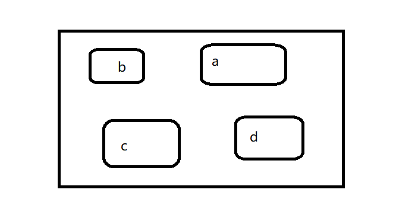
```

每个名字都指向存储在内存中的一个对象

```{r}
e <- new.env()
e$a <- FALSE
e$b <- "a"
e$c <- 2.3
e$d <- 1:3
```


```{r echo=FALSE,fig.align = 'center'}
knitr::include_graphics("img/ch7-2.png")
```


对象并不生存在环境中，所以多个名字可指向同一个对象

```{r}
e$a <- e$d
```


```{r echo=FALSE,fig.align = 'center'}
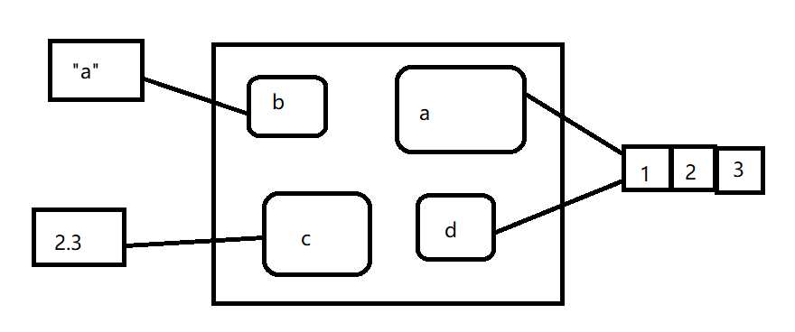
```

令人困惑的是，他们还可以指向具有相同值得不同对象

```{r}
e$a <- 1:3
```


```{r echo=FALSE,fig.align = 'center'}
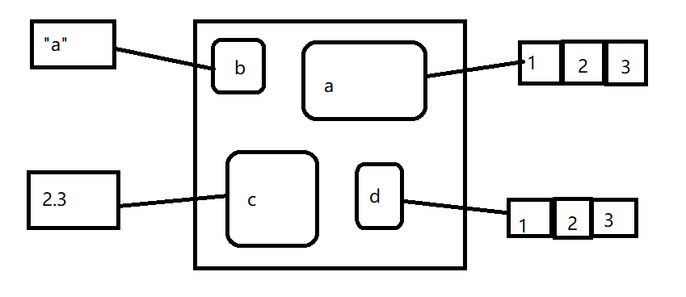
```

如果对象没有指向它的名字，那么这个对象就会被垃圾回收器自动删除。

每个环境都有父环境，他是另外一个环境。在下图中，黑色小圆球代表指向父环境的指针，父环境用于实现词法作用域:如果一个名字在一个环境中没有找到，R就会到他的父环境去找（直到找到或遍历所有环境），只有空（empty）环境没有父环境


```{r echo=FALSE,fig.align = 'center'}
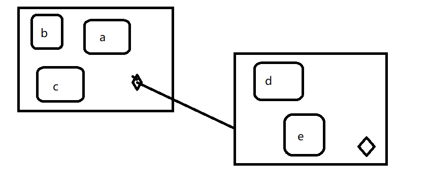
```


我们可以将环境之间的关系比作家庭中成员的关系。一个环境的爷爷就是他父亲的父亲，它的祖先就包括直到空环境的所有父环境。我们基本上不会说一个环境的子环境，因为他们之间没有反向链接，给定一个环境我们没有办法找到它的子环境。

通常环境与列表相似，除一下4点外：

+ 环境中的每个对象都有唯一的名字

+ 环境中的对象没有顺序

+ 环境有父环境

+ 环境具有引用语义

更专业一点，环境是有两部分构成：对象框，它包含名称-对象的绑定关系（行为商更像一个命名列表);它的父环境。

还有4个特殊的环境：

+ globaenv()或者全局环境，他是一个交互式的工作环境，通常情况下我们就是在这个环境工作。全局环境的父环境就是libtary()或require()添加的最后一个包

+ baseenv(),基础环境，他是R基础软件包的环境，他的父环境是空环境

+ emptyenv(),空环境，他是所有环境的祖先，也是唯一一个没有父环境的环境

+ environment(),他是当前环境


下面看一些环境方面的方法：

+ search()

列出全局环境的所有父环境

```{r}
search()
```

+ as.environment()

访问搜索列表中的任何环境

```{r}
as.environment("package:stats")
```

+ new.env()

手动创建一个环境，ls()可以列出将此环境的对象框中的所有绑定关系列出来，可以使用parent.env()查看他的父环境。


```{r}

e <- new.env()

parent.env(e)
ls(e)

```

对一个环境中的绑定关系进行修改的最简单的方法就是将其看做列表

```{r}
e$a <- 1
e$b <- 2
ls(e)
e$a
```

默认情况下，ls()只能列出不是一"."开始的名字，可以通过设置参数all.names=TRUE来显示一个环境中的所有绑定关系：

```{r}
e$.a <- 2
ls(e)
ls(e,all.names=TRUE)
```

+ ls.str()

它可以将环境中的所有对象都显示出来，比str()更有用

```{r}
str(e)
ls.str(e)
```

+ 获取绑定值

```{r}
e$c <- 3
e$c

e[["c"]]
get("c",envir=e)
```

+ 从环境中删除对象

```{r}
e <- new.env()
e$a <- 1
e$a <- NULL #这样相当于创建了一个新的对象
ls(e)

rm("a",envir=e)
ls(e)
```

+ exists()

确定一个绑定是否存在

```{r}
x <- 10
exists("x",envir=e) #查找父环境
exists("x",envir=e,inherits=FALSE) #不希望在父环境中查找
```

+ identical()

identical()与==是不同的，是对两个环境进行比较

```{r}
identical(globalenv(),environment())
#globalenv()==environment()
```

## 环境递归

环境可以构成一棵树，因此我们非常方便的写出一个递归函数，pryr::where()会使用R的作用域法则找到定义这个名字的空间

```{r}
library(pryr)
x <- 5
# where函数由两个参数，一个是查找的名字(字符串)，一个是开始查找的环境
where("x")
```

```r
where <- function(name,env=parent.frame()){
if(identical(env,emptyenv())){
  # Base case
  stop("Can't find",name,call.=FALSE)
}else if(exists(name,envir=env,inherits=FALSE)){
  #Success case
  env
}else{
  #Recursive case
  where(name,parent.env(env))
}
}

```
有三种情况：

+ 基本情况： 已经到达空环境，但没有找到绑定，抛出一个错误

+ 成功情况： 在这个环境中存在该对象，返回该环境

+ 递归情况：在这个环境中没有找到该环境的对象，所以尝试在父环境中继续查找


## 函数环境

大对数环境并不是通过new.env()函数创建的，而是使用函数的结果，本节将讨论4种和函数相关的环境：封闭，绑定，执行和调用。

+ 封闭环境： 创建函数的环境，每个函数有且仅有一个封闭环境

+ 使用<-讲一个函数和一个名字进行绑定，就可以定义一个绑定环境

+ 调用函数创建一个临时的执行环境，用来存储执行期间创建的各种变量

+ 每个执行环境都与一个调用环境关联，他说明函数在哪调用

### 封闭环境

当创建一个函数，他就获得对创建他的函数的引用，这就是封闭环境，他用作此法作用域。为了确定一个函数的封闭空间，只需调用environment()并将函数名作为第一个参数

```{r}
y <- 1
f <- function(x) x+y

environment(f)

```

下图中，圆角矩形代表函数，黑色菱形代表一个函数的封闭环境

```{r echo=FALSE,fig.align = 'center'}
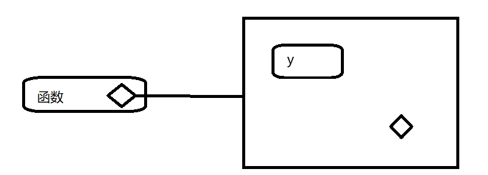
```


### 绑定环境

上图太简单，因为函数没有名字，函数的名字可以通过绑定来定义，一个函数的绑定环境就是与其绑定的所有环境，下图更好的反映这种关系，因为封闭环境包含一个从f到环境的绑定


```{r echo=FALSE,fig.align = 'center'}
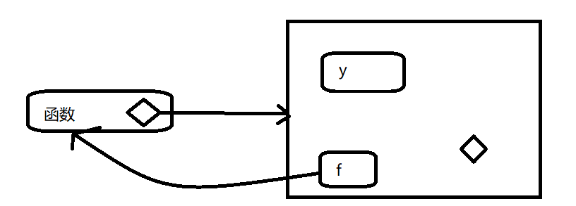
```

这种情况封闭环境和绑定环境是相同的，当将一个函数分配给另一个不同的环境，那么他们就同了

```{r}
e <- new.env()
e$g <- function() 1

```


```{r echo=FALSE,fig.align = 'center'}
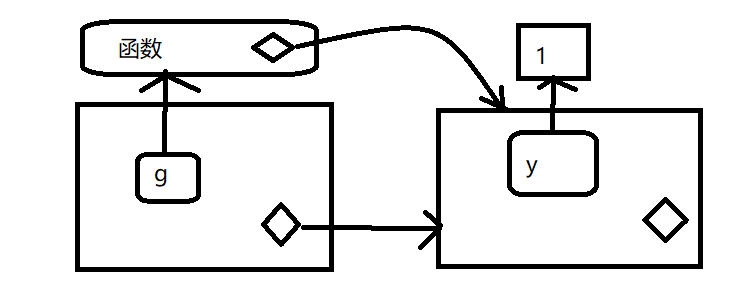
```

封闭函数属于该环境，永远也不会发生改变，甚至将该函数移动到其他环境中，封闭环境决定了这个函数该如何找到值，而绑定环境空间决定如何找到该函数。

绑定空间与封闭空间的区别在于软件包命名空间是非常重要的，例如如果软件包中A使用基础包中的mean()函数，那么如果软件包B也创建了自己的mean()函数会有什么后果呢？命名空间确保软件包A使用基础包中的mean(),而不受软件包B的影响（除非显式的调用）

命名空间使用环境来实现，利用函数不一定存在于他们的封闭环境中的事实，例如基础包中的sd()函数，它的封闭环境与绑定环境是不同的

```{r}
environment(sd)

where("sd")
```

函数sd()的定义使用var()，但是如果创建自己的var()函数，那么他也不会影响sd()

```{r}
x <- 1:10
sd(x)

var <- function(x,na.rm=TRUE) 100

sd(x)
```

这是可执行的，因为每个软件包有两个与他相关的环境：软件包环境和命名空间环境。软件包环境包含所有可以访问的公共函数，并且存放在搜索路径上，命名空间环境包含所有函数，并且它的父环境也是比较重要的环境，其中包含了这个软件包需要的所有函数的绑定。软件包中的每一个到处函数都绑定到软件包环境，但都在命名空间环境中，如下图展示杉树关系：

```{r echo=FALSE,fig.align = 'center'}
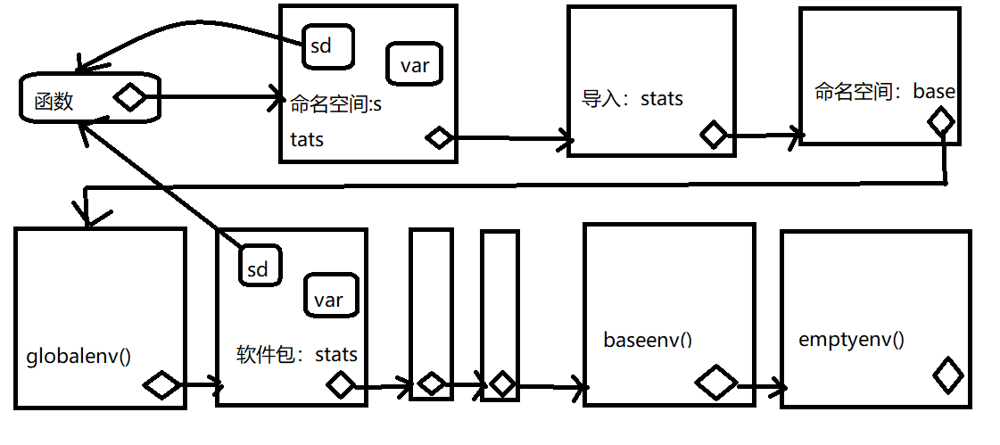
```

当输入var时，R首先会到全局环境中进行查找，当sd()查找var()时，他首先到命名空间中查找，而永远不会到globalenv()中查找。


### 执行环境

第一次执行下面的函数他返回什么？，第二次呢？

```{r}
g <- function(x) {
  if(!exists("a",inherits=FALSE)){
    message("Default a")
    a <- 1
  } else {
    a <- a + 1
  }
  a
}

g(10)
g(10)
```

每次调用这个函数都返回相同的值，每次调用函数时都创建一个新的宿主执行环境，执行环境的父环境就是函数的封闭环境，一旦函数执行结束，这个环境就会被销毁。

通过图形简单了解这个过程：虚线包围的就是执行环境

```{r}
h <- function(x) {
  a <- 2
  x + a
}

y <- h(1)

```

1.用 $x=1$ 调用函数


```{r echo=FALSE,fig.align = 'center'}
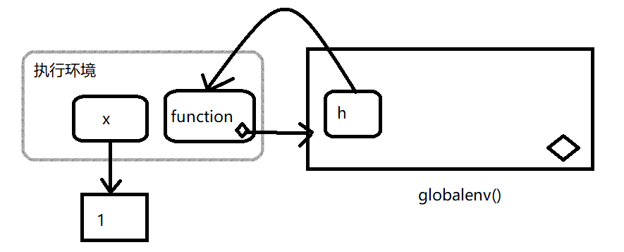
```

2.a被赋值为2


```{r echo=FALSE,fig.align = 'center'}
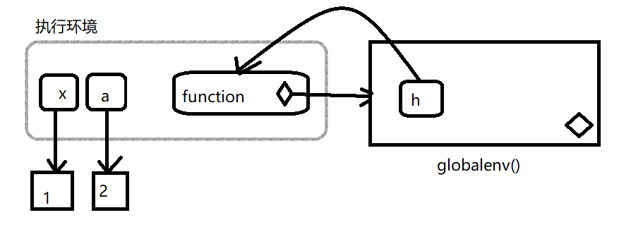
```


3.函数完成后返回值为3

```{r echo=FALSE,fig.align = 'center'}
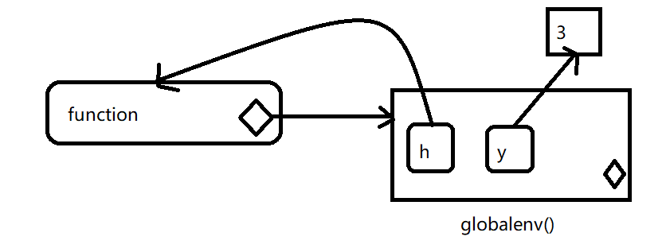
```


当在另一个函数中创建一个函数的时候，子函数的封闭函数就是父函数的执行环境，而且执行环境也不再是临时的了。下面的栗子用一个函数工厂(相当于python闭包，装饰器)plus()来说明这个想法。我们使用这个工厂创建一个plus_one()函数，plus_one()的封闭环境是plus()的执行环境，其中x与数值1绑定


```{r}
plus <- function(x){
  function(y) x+y
  message("Note: ","plus_one also a function")
  
}
plus_one <- plus(1)
#注意plus_one也是一个函数
```


```{r echo=FALSE,fig.align = 'center'}
knitr::include_graphics("img/ch7-13.png")
```

### 调用环境

查看下面代码。当代码运行时，你期望i()返回什么？

```{r}
h <- function(){
  x <- 10
  function(){
    def <- get("x",environment())
    #返回函数被调用的环境
    call <- get("x",parent.frame())
    list(defined=def,called=call,x=x)
    #x
  }
}

i <- h()
x <- 20
i()

#[1] 10
```

最外层的x（绑定到20）是为了分散你的注意力：使用普通作用域法则，h()首先找到自己是在哪里定义的，然后再寻找与x相关联的值10，但是在调用i()的环境中与x相关的值是多少？在定义h()的环境中x为10，在调用h()的环境中x为20.


注意每个执行环境都有两个父环境：一个调用环境和一个封闭环境。R普通作用域法则只使用封闭的父环境，parent.frame()允许你访问调用父环境。在调用环境而不是封闭环境中查找变量称为动态作用域(注：很少的编程语言使用动态作用域，这是因为动态调用使我们更难理解函数式如何运行的，动态调用主要用于开发交互式数据分析的函数)

## 绑定名字和数值 

赋值操作其实就是就是将一个名字和一个值进行绑定，它对应于作用域，这个规则决定如何找到与一个名字相关联的值。可能你已经使用过上千次的R赋值语句，赋值操作为当前环境中的名称和对象建立一种绑定关系。名字通常包括字母，数字，.和_,但是不能以_开头，如果不遵守这些规则，则会出错。

```r
_abc <- 1
#Error: unexpected input in "_"

```

使用?Reserved可以获取完整的保留字列表，这些通常的规则也可以被重写。在一个由任何字符构成的名称的两遍加上反引号，就可以应用该名称了。

```{r}
`a=b` <- 3
`:)` <- "smile"
ls()
```

除了使用反引号外，还可以使用单引号或双引号来创建非语法的绑定，但是不推荐这样做(在赋值箭头左边使用字符串属于历史问题，在R开始支持反引号之前就已经开始使用了)

普通的赋值箭头<-总是在当前环境中创建一个变量。强制赋值箭头<<-不会再当前环境中创建变量，但是他修改父环境中已有的变量，也可以使用assign来进行深度绑定：name <<- value就等价于assign("name",value,inherits=TRUE)

```{r}
x <- 0
f <- function(){
  x <<- 1
}

f()
x
```

还有另外两个绑定：延时绑定和主动绑定

+ 延时绑定：不是立即把结果赋给一个表达式，它创建和存储一个约定，在需要时对约定中的表达式进行求值，用特殊的赋值运算符号%<d-%来创建延迟绑定,他是对delayedAssign()函数的封装，如果需要更多的控制可以使用该函数。

```{r}
library(pryr)
system.time(b %<d-% {Sys.sleep(1); 1})
system.time(b)
```

+ 主动绑定：不是绑定到常量对象，相反，每次对其进行访问时都要重新计算。%<a-%是对基础函数makeActiveBinding()的封装。

```{r}

x %<a-% runif(1)
x
x
rm(x)
```


## 显式环境

除了服务于作用域之外，环境也是一种很有用的数据结构，因此他们有引用语义，与R中的大多数对象不同，当你对环境进行修改时，R不会对其进行复制，例如：

```{r}
modify <- function(x){
  x$a <- 2
  invisible()
}
```

如果将这个函数应用于列表，原始列表不会被改变，因为修改列表实际上是创建和修改副本

```{r}
x_1 <- list()

x_1$a <- 1

modify(x_1)
x_1$a
#[1] 1
```

但是如果将这个函数应用于环境，那么原始环境就会被修改


```{r}
x_e <- new.env()
x_e$a <- 1
modify(x_e)
x_e$a
#[1] 2
```

就像可以使用列表传递数据一样，也可以使用环境，当你创建自己的环境时，应该将父环境设置为空环境，这样确保不会从其他地方继承对象：

```{r}
x <- 1

e1 <- new.env()

get("x",envir=e1)

# e2 <- new.env(parent=emptyenv())
# get("x",envir = e2)

#Error in get("x", envir = e2) : object 'x' not found

```

环境时解决下面3类常见问题的有效数据结构

+ 避免大数据的复制

+ 管理一个软件包的内部状态

+ 根据名字高效的查找与其绑定的值


### 避免复制

由于环境具有引用语义，所有绝不会无意识的创建一个副本。Biocinductor包中经常使用这种技术，因为它经常需要对非常大的基因对象进行管理。在R3.1.0版本后，这种技术已经不像以前那么重要了，因为修改列表不再是深度复制了。以前修改列表的一个元素也要复制整个列表，如果有些元素非常大，就会造成昂贵的操作。


### 软件包状态

显式环境在软件包中很有用，因为他们允许你在函数调用之间保持软件包的状态，正常情况下软件包的对象是被锁定的，所以你不能直接修改他们，但是可以这样做：

```{r}
my_env <- new.env(parent = emptyenv())
my_env$a <- 1

get_a <- function(){
  my_env$a
}

set_a <- function(value){
  old <- my_env$a
  my_env$a <- value
  invisible(old) #不返回old
}

```


### 模拟hashmap

hashmap是一种非常有用的数据结构，它根据名字查找对象的时间复杂度为O(1)。环境默认提供这种行为，所以可以用它来模拟hashmap。CRAN的hash包就是用这种思想开发的


## 总结

截止到这，我们的R语言面型对象的内容介绍完了，回顾起来，首先我们介绍了R语言编程的一些规范，告诉读者要参考一些标准的规范构建自己的编程规范并在团队中做出调整，增加自己代码的可读性和运行效率，紧接着我们分了5章系统全面的介绍了R语言的面向对象编程:S3，S4,R5,R6;最后本章我们介绍了R语言环境的相关知识，环境不仅是作用域的描述，更是一种非常好用的数据结构。

最后希望阅读本电子书的R语言用户，阅读完本书后对你有一点点的帮助。


